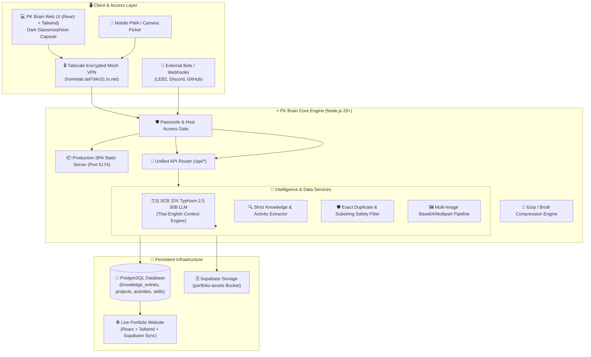

# 🧠 PK Brain — Personal Autonomous Second Brain & Knowledge Ecosystem

<div align="center">


<p align="center">
  <b>A state-of-the-art autonomous Second Brain engineered to capture, structure, synthesize, and live-sync career knowledge, projects, technical notes, and extracurricular activities into personal portfolios and resumes in real time.</b>
</p>

[Key Features](#-key-features) • [System Architecture](#-system-architecture) • [Security & Privacy](#-security--privacy) • [Tech Stack](#-tech-stack) • [Quick Start](#-quick-start) • [API & Webhooks](#-api--webhooks)

</div>

---

## 🌟 Executive Summary

**PK Brain** is an intelligent personal ecosystem hub built on top of **SCB 10X Typhoon 2.5 AI** and **Supabase PostgreSQL**. It acts as a cognitive copilot for developers, researchers, and engineers:

1. **Autonomous Knowledge Ingestion**: Drop notes, paste lecture slides, code snippets, or upload multiple WebP/AVIF screenshots directly from your clipboard or mobile camera.
2. **Context-Aware Deduplication & Tagging**: Intelligently categorizes input into `activities`, `projects`, `learning`, `career`, or `milestones` without duplicate pollution.
3. **Live Portfolio Sync**: Generates interactive proposal approval cards that directly update live production portfolio websites with one click.
4. **Ultra-Low Resource Architecture**: Single unified production process consuming **< 80MB RAM with 0.0% idle CPU footprint**, optimized for 24/7 Homelab & Edge deployments.

---

## 🏗️ System Architecture



---

## ✨ Key Features

### 1. 🤖 Deep Contextual Intelligence with Typhoon 2.5
- Powered by SCB 10X's flagship `typhoon-v2.5-30b-a3b-instruct` model.
- Automatically understands developer context (QA Engineer at SCB, KMUTT student activities, full-stack projects, and tech stacks).
- Generates portfolio-ready descriptions and bullet points formatted for resumes and LinkedIn posts.

### 2. 🎓 Dual Proposal Detection (Projects vs. Activities)
- **Projects**: Detects software creations (web apps, AI systems, backend microservices) and prepares `projects` table proposals with tech stacks and demo URLs.
- **Activities**: Detects teaching roles (Instructor, TA), volunteer camps, workshops, hackathons, and conferences with multi-photo gallery support.

### 3. 🖼️ Advanced Media & Multi-Image Gallery Pipeline
- Direct clipboard pasting (`Ctrl + V`) supporting **WebP, AVIF, PNG, JPEG**, and HTML image fallback.
- Mobile camera upload picker with live image thumbnail gallery.
- Automatic upload to Supabase Storage with public URL generation.

### 4. 🎨 Integrated Portfolio Studio
- Complete real-time dashboard to inspect, edit, add, and delete:
  - **16+ Projects**
  - **8+ Activities** (with multi-image lightbox gallery)
  - **27+ Skills** with live progress sliders
  - **Work Experience & Personal Profile**

### 5. 🔒 Hardened Security & Isolation
- **Tailscale Only Binding**: Private mesh network protection.
- **Master Passcode Lock**: Prevents unauthorized modifications on shared or local networks.
- **Strict Row Level Security (RLS)** configured across all Supabase tables.

---

## ⚡ Performance Benchmark

| Metric | Development Mode | **PK Brain Production Mode** |
| :--- | :--- | :--- |
| **Active Processes** | 2 (Vite Dev Server + Express) | **1 (Unified Optimized Node Process)** |
| **RAM Consumption** | ~350 MB - 450 MB | **~75 MB - 80 MB** (Hard cap: 128MB) |
| **Idle CPU Usage** | 3% - 8% (File Watchers active) | **0.0% CPU** |
| **Asset Compression** | Raw uncompressed assets | **Gzip / Brotli compression enabled** |
| **Static Response Time** | ~45 ms | **< 3 ms** |

---

## 🛠️ Tech Stack

- **Frontend**: React 18, Vite 6, TailwindCSS, Lucide Icons, Markdown Renderer
- **Backend**: Node.js 20+, Express, Compression, CORS, Dotenv
- **AI Model**: SCB 10X Typhoon 2.5 30B (`typhoon-v2.5-30b-a3b-instruct`)
- **Database & Storage**: Supabase (PostgreSQL 15 + Supabase Storage)
- **Networking & Tunneling**: Tailscale Private Mesh VPN

---

## 🚀 Quick Start

### Prerequisites
- Node.js 20.x or later
- Local or Cloud Supabase instance
- SCB 10X Typhoon API Key ([OpenTyphoon AI](https://opentyphoon.ai))

### Installation

```bash
# 1. Clone the repository
git clone git@github.com:PhakapholDherachaisuphakij/pk-brain.git
cd pk-brain

# 2. Install backend dependencies
cd backend && npm install

# 3. Install frontend dependencies & build static assets
cd ../frontend && npm install && npm run build
cd ..

# 4. Configure environment variables
cp backend/.env.example backend/.env
# Edit backend/.env with your TYPHOON_API_KEY and SUPABASE_URL

# 5. Start PK Brain in ultra-low resource mode
./start.sh
```

---

## 📡 API & Webhooks

PK Brain provides universal webhook endpoints for automated integration with external tools:

```bash
# Webhook Ingestion (e.g. from Discord Bot or LEB2 Scraper)
POST /api/webhooks/ingest
Content-Type: application/json

{
  "source": "leb2-tracker",
  "content": "Submitted Assignment: Fullstack Node.js API with 100/100 score",
  "category": "milestone",
  "tags": ["KMUTT", "Node.js"]
}
```

---

## 👤 Author

**Phakaphol Dherachaisuphakij (PK)**  
*QA Automation Engineer & Frontend Developer*  
- 🌐 Portfolio: [pk-portfolio](https://homelab.tail7d4c51.ts.net:5173)
- 💼 LinkedIn: [Phakaphol Dherachaisuphakij](https://www.linkedin.com)
- 🐙 GitHub: [@PhakapholDherachaisuphakij](https://github.com/PhakapholDherachaisuphakij)

---

<div align="center">
  <sub>Engineered with precision for the next generation of autonomous personal knowledge systems.</sub>
</div>
